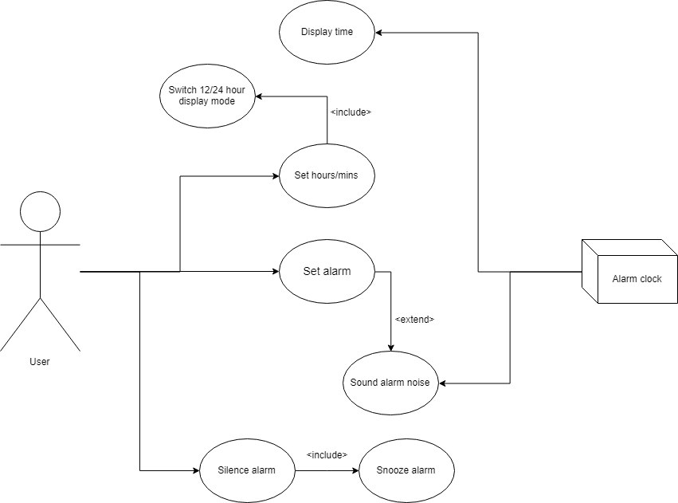

# CS4320-Challenges
## Jacob Zimmer, University of Missouri, Summer 2018

#### [Challenge 1: Github and Markdown](/Challenge1/challenge1.md "Link to challenge content")

___

#### Challenge 2: Use Case Diagram and Description

*We want to develop software for an alarm clock. The clock shows the time of day. Using buttons, the user can set the hours and minutes fields individually, and choose between 12 and 24-hour display. It is possible to set one or two alarms. When an alarm fires, it will sound some noise. The user can turn it off, or choose to “snooze”. If the user does not respond at all, the alarm will turn off itself after 2 minutes. “Snoozing” means to turn off the sound, but the alarm will fire again after some minutes of delay. This “snoozing time” is pre-adjustable.*

###### Use Diagram

###### Use Description

**Set time**
- Preconditions
    - Alarm clock has power supplied
- Postconditions
    - User is satisfied with the time displayed
- Main flow
    1. User presses hour and minute buttons independently
    2. Alarm clock increments the hours and minutes respectively each tiem input is provided
    3. User ceases to press buttons when desired time is displayed
- Alternate flow
    1. User presses 12/24 hour toggle button
    2. Alarm clock converts current hour value to/from 24 hour mode (acceptable values: 00-23)
- Exception: Loss or cycling of power occurs
    2. Alarm clock displays 12:00 default value, blinks at 1 second interval
    3. Process continues with step one of *main flow*

**Set alarm**
- Preconditions
    - Time has been set (is not blinking on clock display)
    - There are less than two saved alarms
- Postconditions
    - Alarm is set to sound at specified time
    - Visual confirmation given to user on alarm clock display
- Main flow
    1. User enters "set alarm" mode with a physical toggle
    2. Process follows *main flow* steps under **Set time**
    3. User presses minute button until desired "snooze" time is displayed on screen
    4. User deactivates physical toggle to exit "set alarm" mode
- Alternate flow
    1. Alarm clock visually indicates there are two previously saved alarms
    2. User toggles between which alarm time will be overwritten
    3. Process continues with step one of *main flow*
- Exception: User does not properly save alarm time
    2. Alarm clock automatically exits "set alarm" mode after a 60 second period of inactivity
    3. Alarm clock erases alarm time from the slot being edited

**Silence alarm**
- Preconditions
    - Alarm time has been set
    - Alarm noise is sounding
- Postconditions
    - Alarm noise is silenced (user intervention notwithstanding)
- Main flow
    1. User actuates the "silence alarm" toggle
    2. Alarm clock ceases to make alarm noise until next indicated alarm time
- Alternate flow
    1. User actuates the "snooze alarm" toggle
    2. Alarm clock ceases to make alarm noise for number of minutes indicated in step three of *main flow* under **Set alarm**
- Exception: No user intervention occurs when alarm noise sounds
    1. Alarm clock ceases to make noise after two minutes of inactivity
    2. User misses their appointment